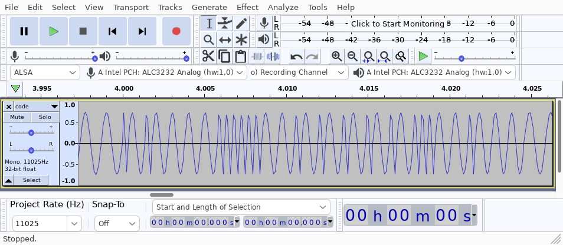
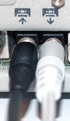

## What's this?

The Apple II has built-in support for reading/writing data to cassette tapes.
We can use this same mechanism to transfer data from a modern computer to an
Apple II.

This tool converts Applesoft BASIC source code into a .wav audio file. The
sound waves encode bits of data: a short pulse is a 0, and a long pulse is a 1.



## How do I use it?

### Installation

Install [Rust](https://www.rust-lang.org/tools/install), and then run:
```
$ cargo install bas2wav
```

### Usage

To convert `basic-program.bas` to `basic-program.wav`, run:
```
$ bas2wav basic-program.bas
```

### Now what?

Power on the Apple II, and press ctrl+reset to get to a BASIC prompt.

Plug in an aux cable to your laptop's audio output, and the Apple's audio input
(right hand side).



Type `LOAD` on the Apple, and press return. The Apple is now "listening".

On your laptop, play the audio file `basic-program.wav` using a web browser or
music player. This transfers data from your computer to the Apple II.

And that's it! Once the audio finishes playing, you should hear a "beep" from
the Apple II, and be returned to the BASIC prompt. You can type `LIST` to see
your program, and `RUN` to run it.
